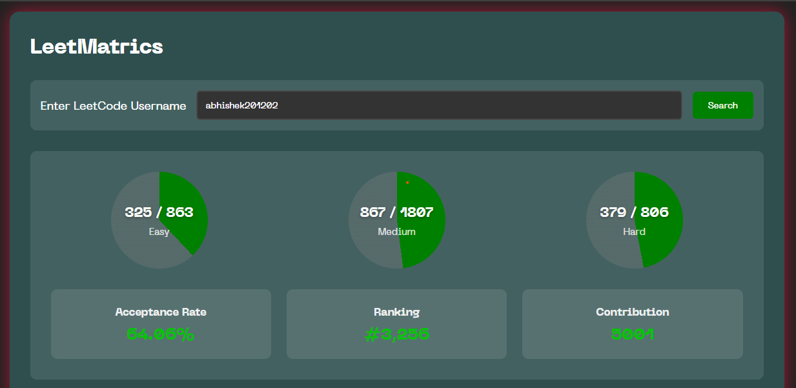

# LeetMatrics 📊



## A sleek dashboard for visualizing LeetCode user statistics, built with modern web technologies.

**Live Demo:** [https://leetmatrics-jha.vercel.app/](https://leetmatrics-jha.vercel.app)

## Features ✨

- 📈 Visual progress circles for Easy/Medium/Hard problems
- 🏆 Key statistics cards (Acceptance Rate, Ranking, Contribution Points)
- 🔍 Real-time LeetCode profile lookup
- 📱 Fully responsive design
- 🛠 Input validation and error handling
- 🌓 Accessible interface with proper ARIA labels
- ⚡ Instant search feedback with loading states

## Tech Stack 🛠️

**Frontend:**

- HTML5 (Semantic Markup)
- CSS3 (Custom Properties, Grid/Flexbox, Animations)
- Vanilla JavaScript (ES6+)

**API:**

- [LeetCode Stats API](https://github.com/JeremyTsaii/leetcode-stats-api)

## Installation ⚙️

1. Clone the repository:

```bash
git clone https://github.com/abhisekumarjha/LeetMatrics.git
```

2. Navigate to project directory:

```bash
cd LeetMatrics
```

2. Open in browser:

```bash
open index.html  # Or double-click the file
```

## Live Demo 🔗

**_[https://leetmatrics-jha.vercel.app/](https://leetmatrics-jha.vercel.app)_**
